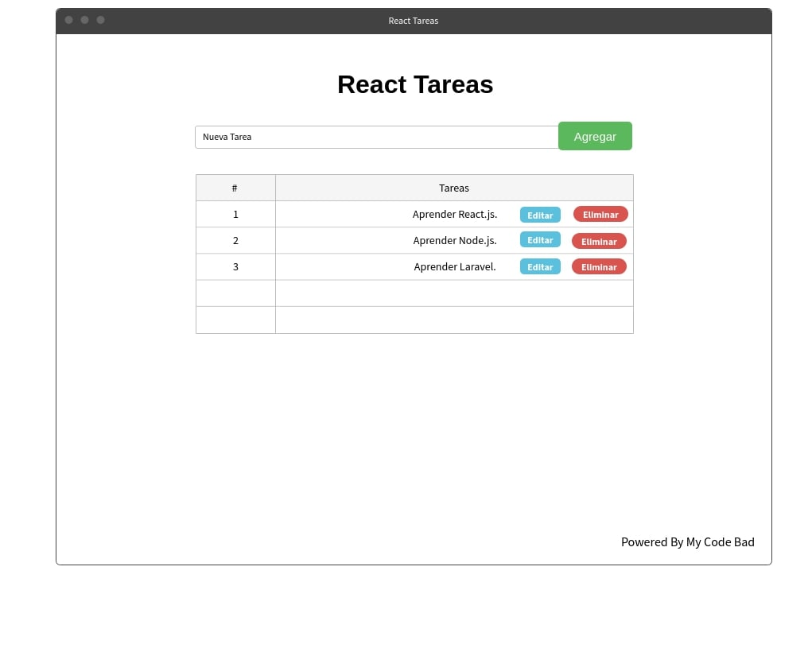

### Introducción

En esta serie, crearemos una pequeña aplicación de Tareas, que tendra una Api Rest el marco a utilizar se decidira más adelante; pero estoy en estas 2 opciones: Nodejs o Laravel.

### Requisitos

Antes de comenzar el proyecto, necesitamos tener instalado algunos requerimientos, que describire a continuación:

- Conocimientos de Javascript, css3, html5.
- Tener instalado [Node.js](https://nodejs.org/es/)
- Tener instalado el cliente de react [create-react-app](https://github.com/facebook/create-react-app)

Para tener bases de javascript, les puedo recomendar este curso de [@FalconMaster](https://www.youtube.com/playlist?list=PLhSj3UTs2_yVC0iaCGf16glrrfXuiSd0G)

### Mockup

La maquetación que haremos para la aplicación es algo sencilla, pero la diseñe en esta app
[mockflow](https://mockflow.com/).

En los siguientes posts, estaremos comenzando con la maquetación.

Nos vemos. My Code Bad!
