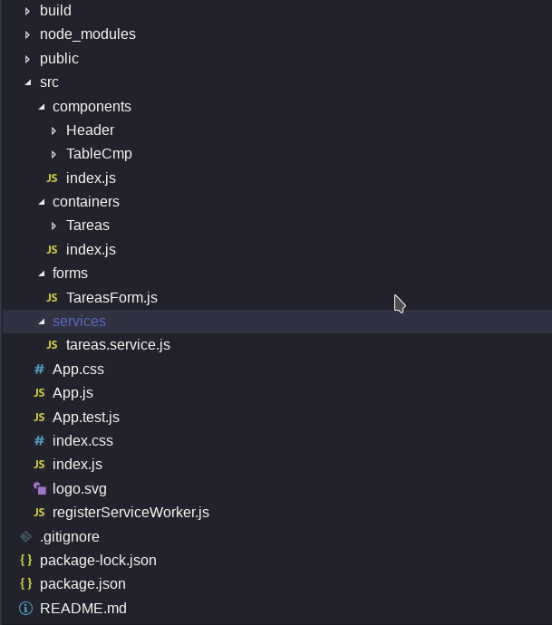
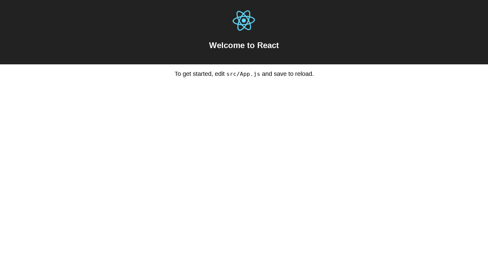
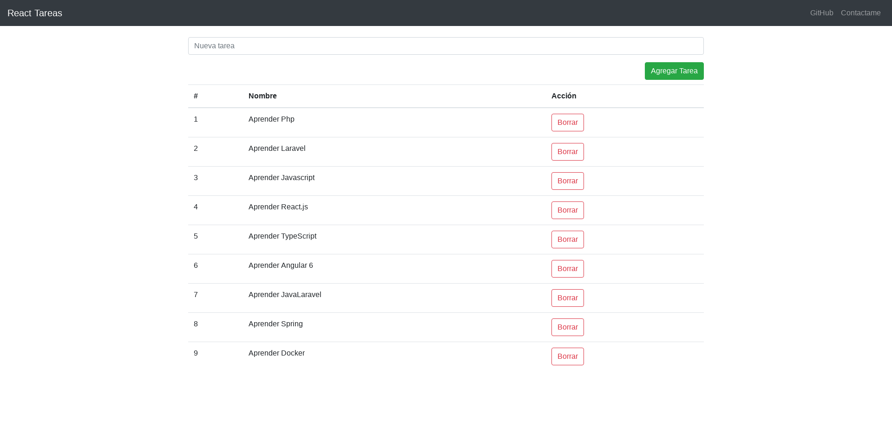

### Introducción

En esta primera parte, crearemos todo lo necesario para empezar con nuestro "React Tareas".

El proyecto tendra la siguiente estructura.



### Comencemos !

#### Creando el proyecto.

Recordar que tenemos que tener instalado el cli de react [create-react-app](https://github.com/facebook/create-react-app) , en nuestro computador.

Nos ubicamos en nuestro directorio de trabajo, y ejecutamos el siguiente comando, nos permitira crear toda la estructura basica de react.js instalada todas las dependencias necesarias.

```ssh
$ create-react-app react-tareas
```

Luego entramos a la carpeta de nuestro proyecto y levantamos el proyecto.

```ssh
$ cd react-tareas
react-tareas $ npm run start
```

Nos abrira en el navegador en la dirección [http://localhost:3000](http://localhost:3000)


#### Manos al código.

Para la parte de estilo usaremos [Bootstrap 4](https://getbootstrap.com/) y [reactstrap](https://reactstrap.github.io/), e instalaremos dichas dependencias necesarias.

```ssh
react-tareas $ npm i -S boostrap reactstrap
```

Luego editamos el index.js agregando el estilo de bootstrap.

```javascript
import React from 'react'
import ReactDOM from 'react-dom'
import './index.css'
import App from './App'
import registerServiceWorker from './registerServiceWorker'
import '../node_modules/bootstrap/dist/css/bootstrap.min.css'
ReactDOM.render(<App />, document.getElementById('root'))
registerServiceWorker()
```

Comenzaremos editando el archivo `App.js`.

```javascript
import React, { Component } from 'react'
import { Header } from './components'
import { Tareas } from './containers'
class App extends Component {
  render() {
    return (
      <div>
        <Header />
        <Tareas />
      </div>
    )
  }
}
export default App
```

Creamos nuestro componente `Header` en la ruta `src/components/Header`

```javascript
import React, { Component } from 'react'
import { Header } from './components'
import { Tareas } from './containers'
class App extends Component {
  render() {
    return (
      <div>
        <Header />
        <Tareas />
      </div>
    )
  }
}
export default App
```

Creamos nuestro container `Tareas` en la ruta `src/containers/Tareas`

```javascript
import React, { Component } from 'react'
import TareasForm from './../../forms/TareasForm'
import { TableCmp } from './../../components'

class Tareas extends Component {
  state = {
    tareas: [],
  }
  numeroAleatorio = (min, max) => {
    return Math.round(Math.random() * (max - min) + min)
  }
  borrarTarea = index => {
    const { tareas } = this.state

    this.setState({
      tareas: tareas.filter((tarea, i) => {
        return i !== index
      }),
    })
  }
  agregarTarea = tarea => {
    this.setState({
      tareas: [
        ...this.state.tareas,
        { nombre: tarea.tareaNueva, id: this.numeroAleatorio(1, 100) },
      ],
    })
  }
  render() {
    const { tareas } = this.state
    return (
      <div className="container">
        <br />
        <TareasForm agregarTarea={this.agregarTarea} />
        <br />
        <br />
        <TableCmp tareasDatos={tareas} borrarTarea={this.borrarTarea} />
      </div>
    )
  }
}
export default Tareas
```

Creamos nuestro formulario `TareasForm` en la ruta `src/forms/TareasForm`

```javascript
import React, { Component } from 'react'
import { Button, Form, FormGroup, Input } from 'reactstrap'

class TareasForm extends Component {
  constructor(props) {
    super(props)
    this.initialState = {
      tareaNueva: '',
    }
    this.state = this.initialState
  }
  handleChange = event => {
    const { target } = event
    const value = target.value
    const { name } = target

    this.setState({
      [name]: value,
    })
  }
  submitForm(e) {
    e.preventDefault()
    this.props.agregarTarea(this.state)
    this.setState(this.initialState)
  }
  render() {
    return (
      <Form onSubmit={e => this.submitForm(e)}>
        <FormGroup>
          <Input
            type="text"
            name="tareaNueva"
            id="tareaNueva"
            value={this.state.tareaNueva}
            placeholder="Nueva tarea"
            onChange={e => this.handleChange(e)}
          />
        </FormGroup>
        <Button className="float-right" color="success">
          Agregar Tarea
        </Button>
      </Form>
    )
  }
}
export default TareasForm
```

Creamos nuestro componente `TableCmp` en la ruta `src/components/TableCmp`

```javascript
import React, { Component } from 'react'

import { Table, Alert, Button } from 'reactstrap'

const TableHeader = () => {
  return (
    <thead>
      <tr>
        <th>#</th>
        <th>Nombre</th>
        <th>Acción</th>
      </tr>
    </thead>
  )
}

const TableBody = props => {
  const rows = props.tareasDatos.map((row, index) => {
    return (
      <tr key={index}>
        <td>{index + 1}</td>
        <td>{row.nombre}</td>
        <td>
          <Button
            outline
            color="danger"
            onClick={() => props.borrarTarea(index)}
          >
            Borrar
          </Button>
        </td>
      </tr>
    )
  })
  return <tbody>{rows}</tbody>
}

class TableCmp extends Component {
  render() {
    const { tareasDatos, borrarTarea } = this.props

    if (tareasDatos !== undefined && tareasDatos.length > 0) {
      return (
        <Table>
          <TableHeader />
          <TableBody tareasDatos={tareasDatos} borrarTarea={borrarTarea} />
        </Table>
      )
    } else {
      return <Alert color="info">No existen tareas!</Alert>
    }
  }
}

export default TableCmp
```

Finalmente tendremos ya maquetado y con una funcionalidad basica de nuestro proyecto react-tareas.



Puedes ver el [demo](https://guillermoparedes.github.io/react-tutorial/).

En los siguientes posts, estaremos agregando más funcionalidades.

Nos vemos. My Code Bad!
